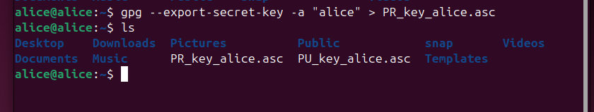
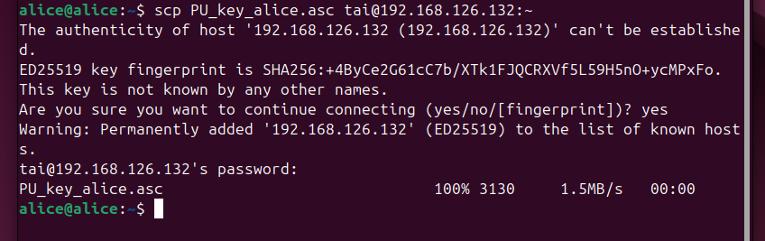
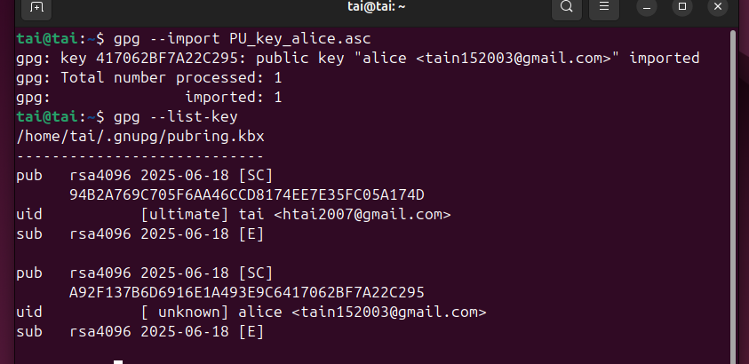

***1. Cài đặt Thunderbird và OpenPGP trên cả hai máy***

    sudo apt update && sudo apt install thunderbird -y

***2. Tạo cặp khóa PGP trên mỗi máy***

Mỗi máy sẽ có một cặp khóa (khóa công khai và khóa riêng tư).

***Trên Ubuntu (Alice)***: 

1. Mở terminal, tạo cặp khóa PGP:

        gpg --full-generate-key

2. Chọn thông tin như sau:

- ***Loại khóa***: RSA and RSA (default)
- ***Độ dài khóa***: 4096
- ***Thời gian hết hạn***: Tùy chọn (ví dụ: 0 để không hết hạn).
- ***Tên và email***: Nhập thông tin.
- ***Mật khẩu bảo vệ khóa***: Nhập mật khẩu an toàn.

  

3. Kiểm tra danh sách khóa đã tạo:

        gpg --list-keys

  

4. Xuất khóa công khai để gửi cho máy Ubuntu:

        gpg --export -a "tên_hoặc_email" > PU_key_alice.asc

  

5. Xuất khóa riêng tư (dùng để tạo chữ ký điện tử):

        gpg --export-secret-key -a "tên_hoặc_email" > PR_key_alice.asc

    *Lưu ý, cần nhập mật khẩu đã tạo khi xuất khóa riêng tư.*

  

***Trên Ubuntu (Tai)***

- Thực hiện tương tự các bước trên để tạo cặp khóa cho Ubuntu.

  

- Sau đó, xuất khóa công khai của Ubuntu:

        gpg --export -a "tên hoặc email của bạn" > PU_key_tai.asc

  

- Xuất khóa riêng tư của Ubuntu: 

  

***3. Trao đổi khóa công khai giữa hai máy***

Sử dụng công cụ ***SCP*** để trao đổi khóa công khai giữa bên gửi và bên nhận

***Kích hoạt địch vụ SSH để trao đổi khóa ở cả hai máy***

Máy Ubuntu (Alice)

  

Máy Ubuntu (Tài)

  

***Địa chỉ IP của hai máy***

Máy Ubuntu (Alice)

  

Máy Ubuntu (Tài)

  

***Trao đổi khóa giữa hai máy***

Gửi khóa công khai của Alice tới Tai, sử dụng lệnh ***scp*** trên máy alice: 

    scp PU_key_alice.asc tai@192.168.126.132:~

  
  

Gửi khóa công khai của Tai tới Alice, sử dụng lệnh ***scp*** trên máy tai: 

    scp PU_key_tai.asc tai@192.168.126.197:~

  
  

***Nhập các khóa vừa trao đổi vào PGP***

Trên máy Alice, import khóa công khai của tai: 

  

Trên máy tai, import khóa công khai của alice: 

  

***4. Cấu hình Thunderbird để sử dụng PGP***

***Bước 1: Mở Thunderbird và thêm tài khoản email***

1. Mở Thunderbird trên cả hai máy.

2. Thêm tài khoản email.

3. Đảm bảo Thunderbird có thể gửi và nhận email bình thường.

***Máy Alice***: 

  

  

  

***Máy Tai***

  

  

  

***Bước 2: Cấu hình OpenPGP***

1. Vào Thunderbird, chọn Tools (hoặc Settings).

2. Chọn Account Settings > End-to-End Encryption.

3. Chọn Add Key > Import an existing OpenPGP key.

4. Chọn khóa PGP (private_key_kali.asc trên Kali, private_key_ubuntu.asc trên Ubuntu).

5. Sau khi nhập thành công, đặt khóa này làm khóa mặc định cho tài khoản email.

*Lưu ý, cần chọn khóa riêng tư làm khóa mặc định nhằm tạo chữ ký điện tử xác định danh tính bên gửi thì mới có thể encrypt được mail.* 

***Máy Alice***

  

  

  

  
  
*Lưu ý, cần nhập mật khẩu đã tạo khi sinh khóa riêng tư nếu muốn import key.*

  

  

***Máy Tai***

  

  

***5. Gửi email mã hóa từ Kali sang Ubuntu***

1. Trên Thunderbird của Kali, soạn email mới.

2. Nhập địa chỉ email của Ubuntu.

3. Chọn Encrypt

4. Soạn nội dung, nhấn Send.

***Máy Alice***

Soạn mail và chọn encrypt: 

*Khi được yêu cầu khóa công khai của bên nhận để mã hóa email, click vào Resolve*. 

  

Chọn PU_key_tai:

  

Import thành công khóa công khai của máy tai: 

  

Chọn Encrypt và Send Email:

  

***Máy Tai***

Trong trường hợp PR_key_tai chưa được import, không xem được email gửi từ bên Kali đã được mã hóa bằng public_key_ubuntu:

  

Trong trường hợp đã import PR_key_tai và PU_key_alice:

  
  

Xem được email và xác nhận được tính toàn vẹn của email: 

  
